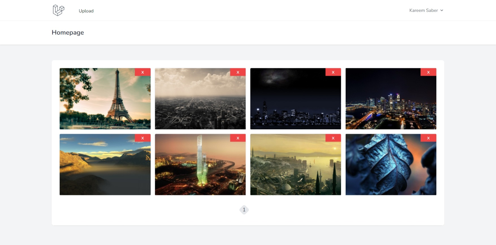
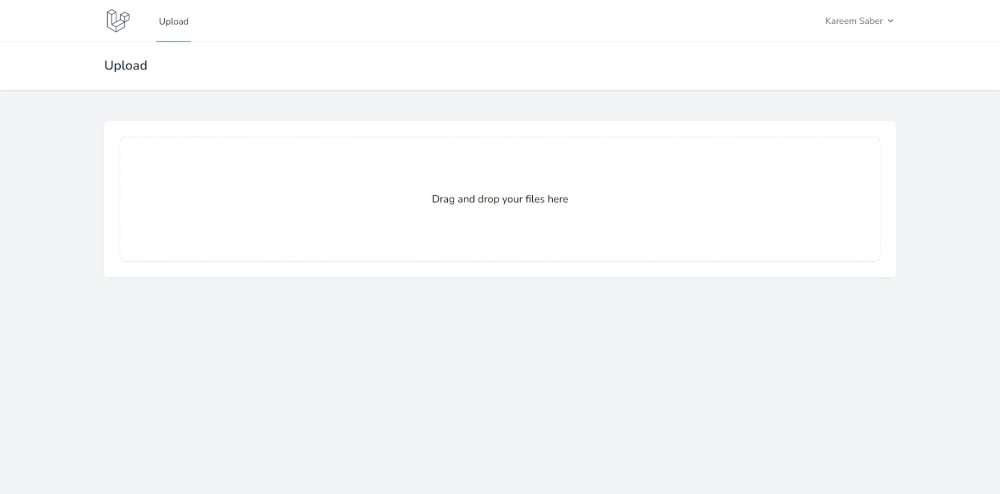
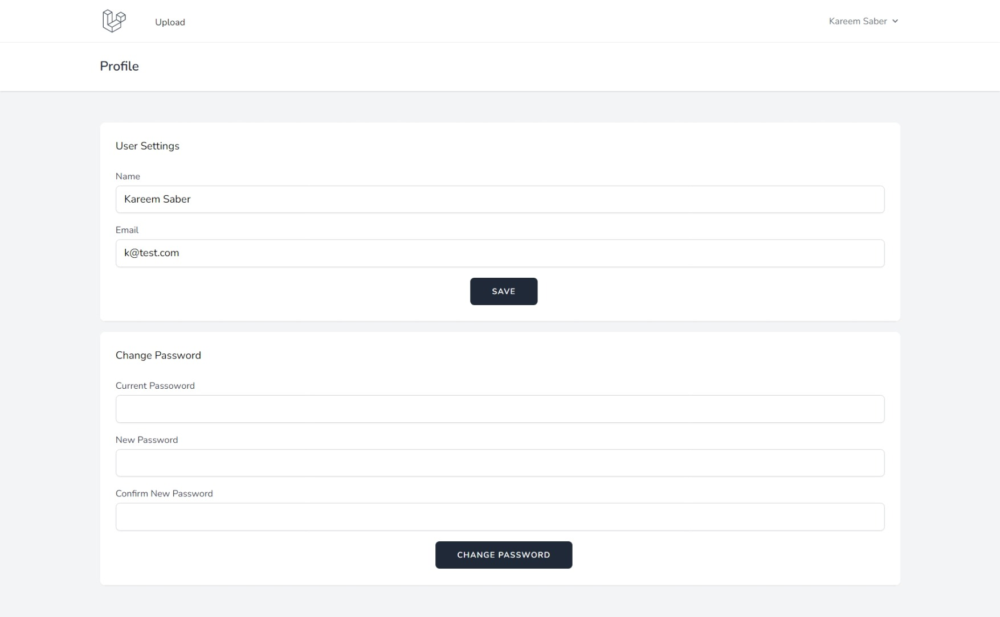
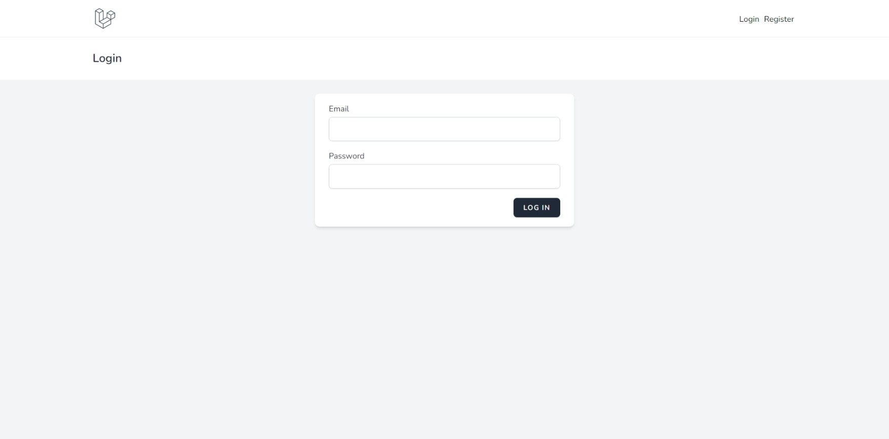

# Laravel Vue Gallery
A Demo project to practice Vue.js with Laravel and SPA techniques like:
Authentication, Pagination, File Upload, State Management.
## Features

-   SPA.
-   Authentication Using Sanctum.
-   Drag and drop images (requires your account)
-   Pagination
-   Delete Images.

## Tech
-   TailwindCSS
-   Vue.Js 3.
-   Vuex.
-   VueRouter.
-   Laravel 8.
-   Fortify.
-   Sanctum.

## To-Do

-   [x] Profile Settings (For Users).
-   [x] Add Images to Readme

## Images






## Installation

```sh
git clone https://github.com/Kaynite/gallery.git
cp .env.example .env
composer install
npm install
npm run dev
```

> Add your database connection settings 

```sh
php artisan migrate
php artisan serve
```


For production environments...

```sh
npm run prod
```
